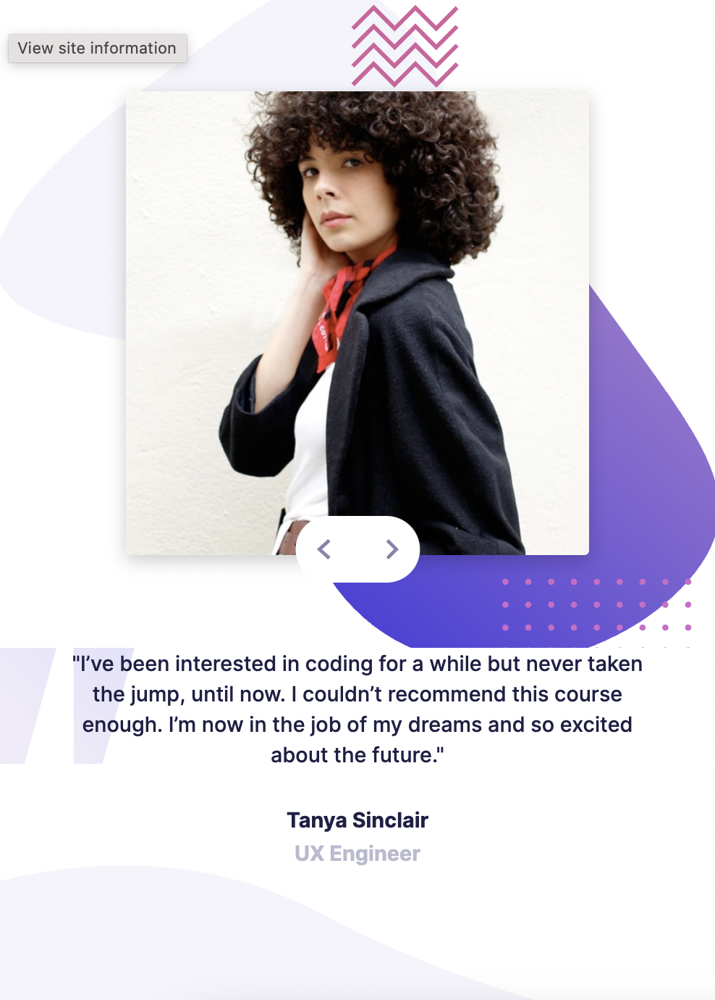
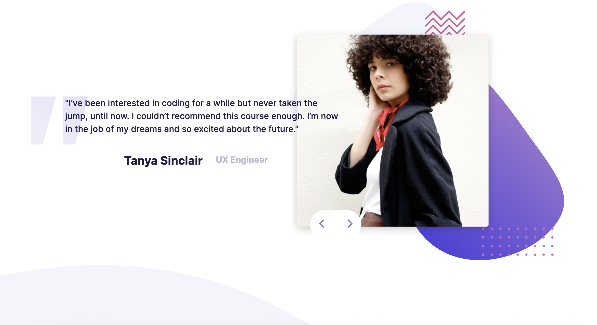
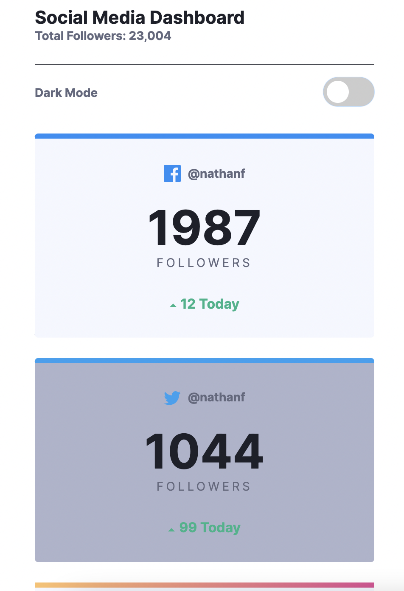
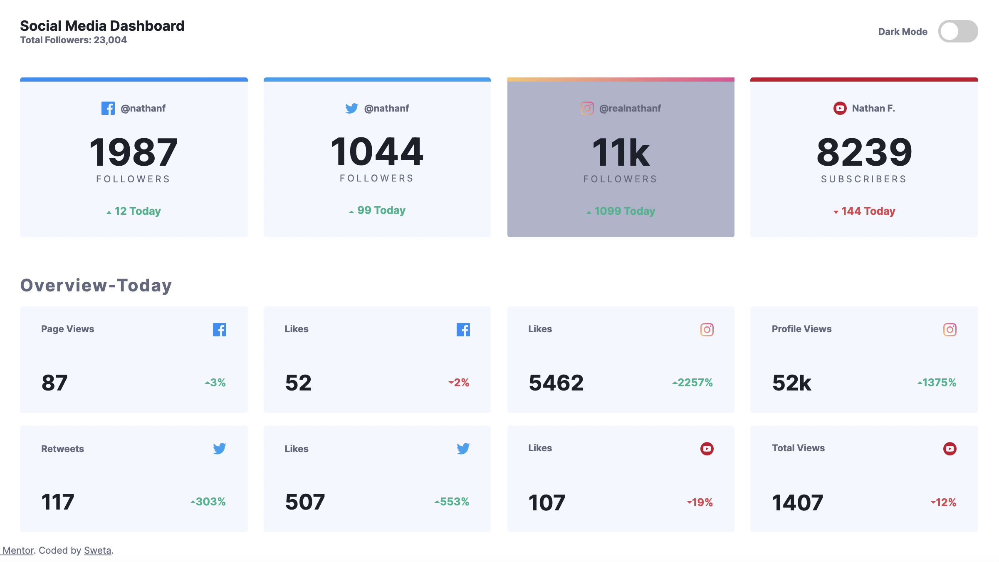
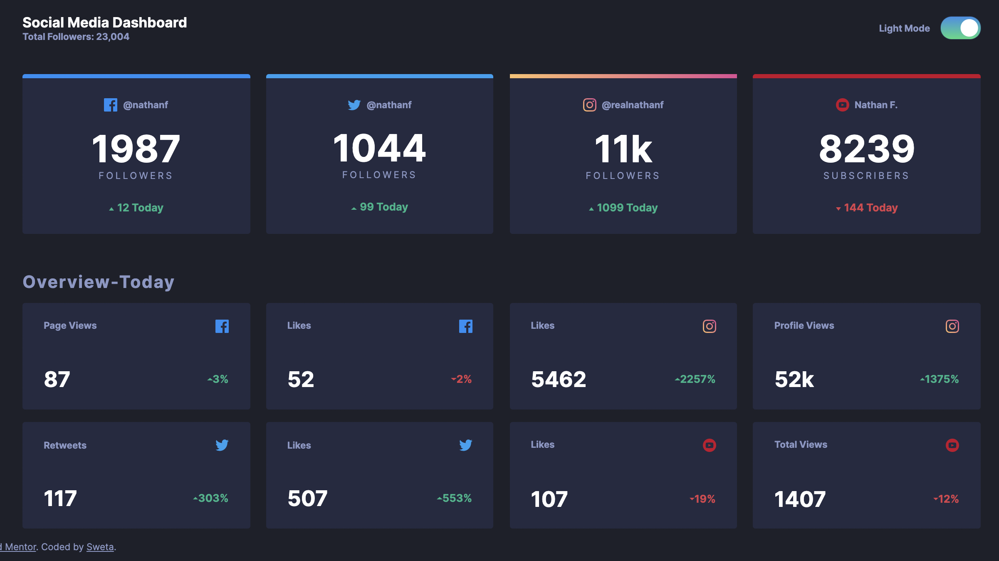

## Frontend Mentor Challenges

1. Coding bootcamp testimonials slider / built with CSS and JS

- [See project on Netlify](https://sweta-fm-testemonial-slider.netlify.app)
- Working with background images
- Position relative/absolute to position prev/next buttons
- JS for looping through different slides

    

 

    

 

2. Social media dashboard with theme switcher / built with CSS and JS

- JS part: toggle between light and dark mode
- Create toggle switch button
- Practicing grid

    

 

    

 

    

 
