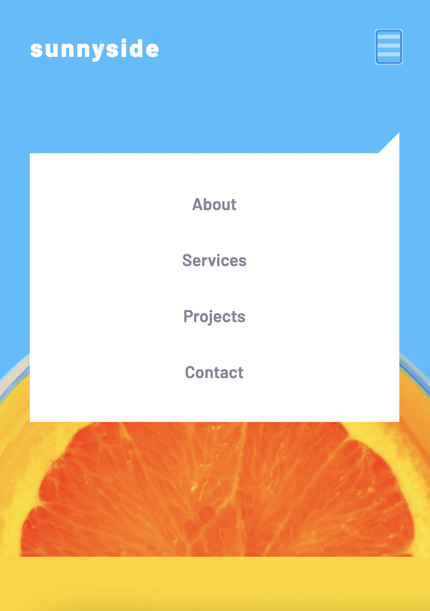
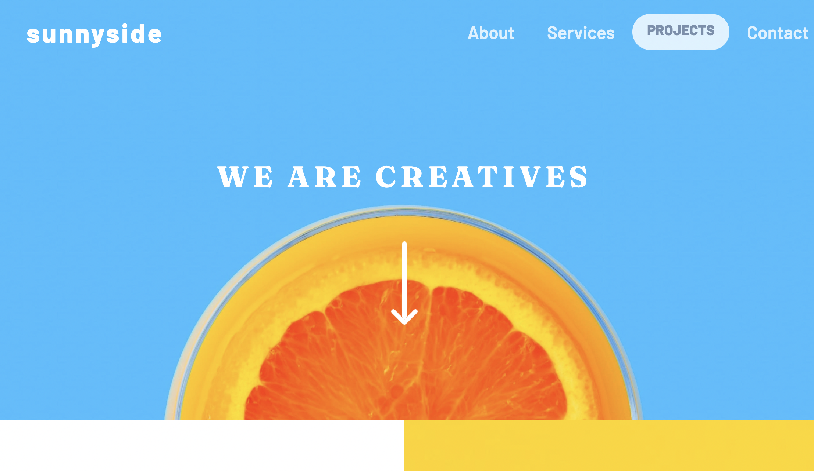
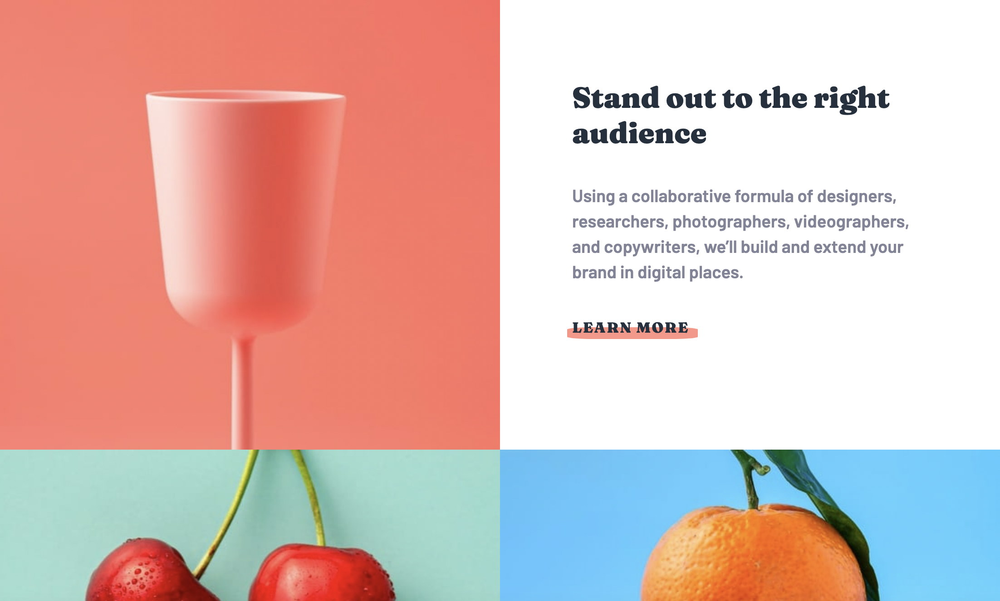
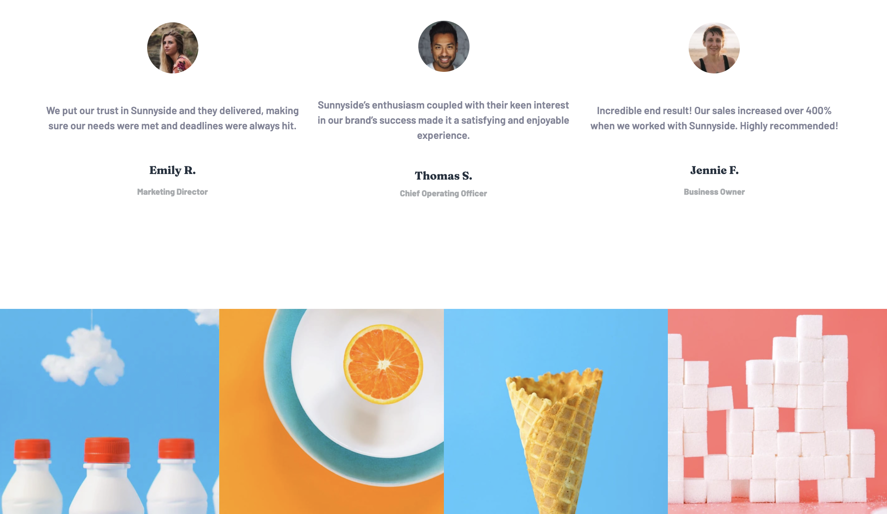
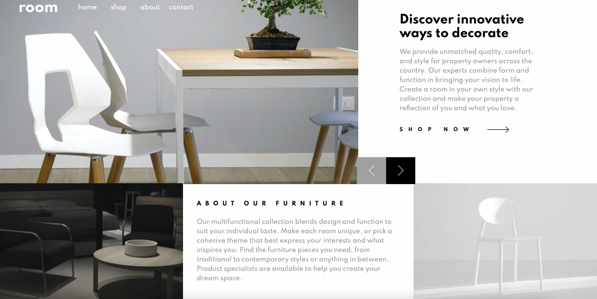
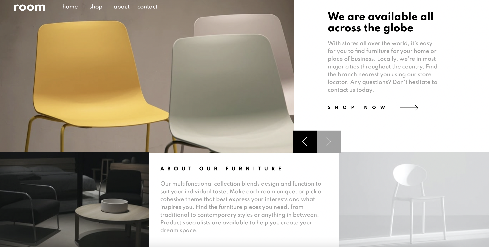
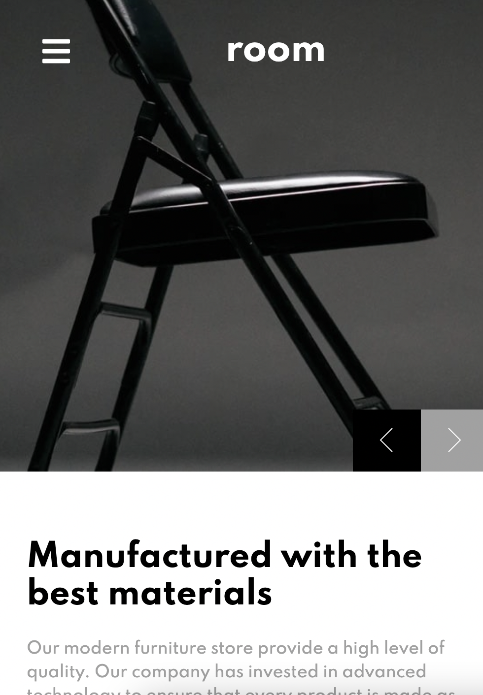

## Frontend Mentor Challenges

1. Coding bootcamp testimonials slider / built with CSS and JS

- [See project on Netlify](https://sweta-fm-testemonial-slider.netlify.app)
- Working with background images
- Position relative/absolute to position prev/next buttons
- JS for looping through different slides

    

 

    

 

2. Social media dashboard with theme switcher / built with CSS and JS

- [See project on Netlify](https://sweta-fm-social-media-dashboard-with-theme-switcher.netlify.app)
- JS part: toggle between light and dark mode
- Create toggle switch button
- Practicing grid

    

 

    

 

    

 

3. Sunnyside agency landing page / built with CSS and JS

- [See project on Netlify](https://sweta-fm-sunnyside-agancy.netlify.app)
- JS for mobile navigation toggle
- CSS
  - underline styling
  - hover on ::before element
  - navbar / sidebar toggle
  - sidebar as speech bubble; on hover => pill button

    

 

    

 

    

 

    

 

4. Room Agency homepage / Responsive Landing Page with Sliding Images/Text using CSS / JS

- [See project on Netlify](https://sweta-fm-room-agency.netlify.app)
- Navigation for small/bigger screen
- JS for slider

    

 

    

 

    

 

5. Bookmark Landing Page / CSS and JS

- Toggling between navbar and sidebar
- Before/after elements
- Active class on a button, switching the active content
- Open/close answers functionality; traversing the DOM
